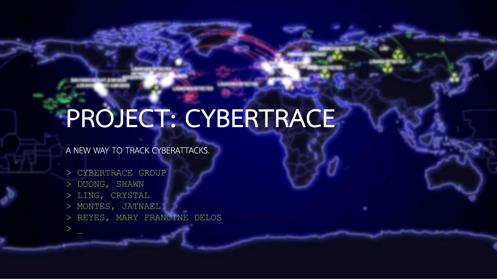

# PROJECT: CYBERTRACE - A New Way to Track Cyberattacks

***This project was a proof-of-concept demo'ed in 2021. This is archived for historical purposes. Future development of this will not happen on this repository.***

**CyberTrace** is a framework for tracking, tracing, classifying, and analyzing cyberattacks using advanced detection algorithms based on analysis of live attack fingerprints. CyberTrace comes in two primary parts:

1. The **front-end CyberTrace web application** serves a geographic UI and visualizes live attacks and their origins, as well as communicating possible attack classifications, threat actor histories, possible APTs, and more.

2. The **back-end CyberTrace daemon** is a highly modular framework that monitors log files, network activity, and system activity to detect and classify cyberattacks based on fingerprints using detection algorithms defined in framework modules.

## Contributing

Please refer to the [Contribution Guide](https://github.com/shawnduong/CyberTrace/wiki/Contribution-Guide) for more information on how to contribute to this project.

## License

This project is published under the MIT License.

*tl;dr: you may do whatever you want with this project, including for personal, educational, and/or commercial purposes, completely free, provided that a [copy of the license](./LICENSE) is included in all redistributions in order to ensure those same freedoms to others.*

> MIT License
> 
> Copyright (c) 2021 CyberTrace Group
>
> Permission is hereby granted, free of charge, to any person obtaining a copy of this software and associated documentation files (the "Software"), to deal in the Software without restriction, including without limitation the rights to use, copy, modify, merge, publish, distribute, sublicense, and/or sell copies of the Software, and to permit persons to whom the Software is furnished to do so, subject to the following conditions:
> 
> The above copyright notice and this permission notice shall be included in all copies or substantial portions of the Software.
>
> THE SOFTWARE IS PROVIDED "AS IS", WITHOUT WARRANTY OF ANY KIND, EXPRESS OR IMPLIED, INCLUDING BUT NOT LIMITED TO THE WARRANTIES OF MERCHANTABILITY, FITNESS FOR A PARTICULAR PURPOSE AND NONINFRINGEMENT. IN NO EVENT SHALL THE AUTHORS OR COPYRIGHT HOLDERS BE LIABLE FOR ANY CLAIM, DAMAGES OR OTHER LIABILITY, WHETHER IN AN ACTION OF CONTRACT, TORT OR OTHERWISE, ARISING FROM, OUT OF OR IN CONNECTION WITH THE SOFTWARE OR THE USE OR OTHER DEALINGS IN THE SOFTWARE.
